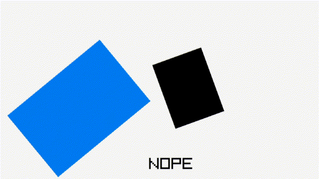

# OrientedCollisionsRay
  
C library with additional raylib style functions for checking collisions.  
[Raylib](https://www.raylib.com/) is required since this is specifically built to be used with raylib.  
This could be useful for someone who doesn't want to use a full physics engine, but also needs oriented collision checks, which raylib does not include. Currently this library features only 2D collision checking, but there are plans to add oriented 3D collision checks.
  
Raylib already includes an unoriented rectangle structure, and allows drawing it with a rotation.
The collision checks in this library follow the same [style](https://www.raylib.com/cheatsheet/cheatsheet.html), where you use an unorinted rectangle with a separate rotation value.
Similarly to drawing rectangles the rotation is in degrees and the rectangle is rotated around the top left corner.

### Quick reference
```c
// Check if point is inside oriented rectangle  
bool CheckCollisionPointOrientedRec(Vector2 point, Rectangle rec, float rotation);  
// Check collision between line and circle  
bool CheckCollisionLineCircle(Vector2 p1, Vector2 p2, Vector2 center, float radius);  
// Check collision between line and rectangle  
bool CheckCollisionLineRec(Vector2 p1, Vector2 p2, Rectangle rec);  
// Check collision between line and oriented rectangle  
bool CheckCollisionLineOrientedRec(Vector2 p1, Vector2 p2, Rectangle rec, float rotation);  
// Check collision between circle and oriented rectangle  
bool CheckCollisionCircleOrientedRec(Vector2 center, float radius, Rectangle rec, float rotation);  
// Check collision between rectangle and oriented rectangle  
bool CheckCollisionRecOrientedRec(Rectangle rec1, Rectangle rec2, float rotation2);  
// Check collision between 2 oriented rectangles  
bool CheckCollisionOrientedRecs(Rectangle rec1, float rotation1, Rectangle rec2, float rotation2);  
```
